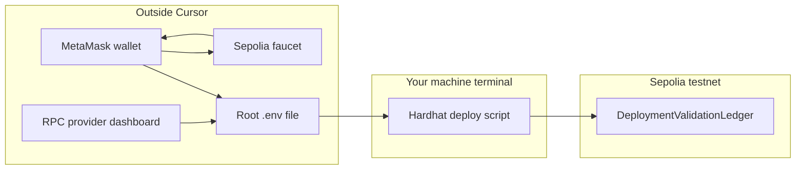

# Off-Cursor + finish deploy (Sepolia, no paid ETH)

Default network: **Sepolia** (widest faucet/RPC support). Your contract is [`DeploymentValidationLedger.sol`](contracts/DeploymentValidationLedger.sol); deploy script is [`scripts/deploy.js`](scripts/deploy.js). Root [`package.json`](package.json) already has `"deploy": "hardhat run scripts/deploy.js"`. [`hardhat.config.js`](hardhat.config.js) currently has **no `networks`**, so deploy today only targets the in-memory Hardhat chain unless you add config (see end).

---

## Phase A — Browser and wallet (outside Cursor)

1. **Install MetaMask** (if not installed): [https://metamask.io/download/](https://metamask.io/download/) — browser extension or mobile. Complete the onboarding **seed phrase backup** (write on paper; never screenshot to cloud, never paste in chat).

2. **Use one clear role for “deployer”**  
   - Either create a **fresh account** inside MetaMask named `SepoliaDeployer`, or use an existing account you are okay exposing as a deploy key.  
   - **Copy only the public address** (0x + 40 hex) for faucets. Do **not** export the private key until Phase C.

3. **Enable Sepolia in MetaMask**  
   - Settings → Networks → enable **Show test networks** (wording varies by version), then select **Sepolia** from the network list.  
   - Confirm the chain id shown for Sepolia is **11155111** (if MetaMask shows it).

4. **Optional sanity check in MetaMask**  
   - Switch to Sepolia, confirm balance is **0 ETH** before the faucet step.

---

## Phase B — Free RPC (outside Cursor)

You need an HTTPS endpoint so Hardhat can broadcast transactions to Sepolia.

1. **Create a free account** with a provider (pick one):  
   - [Alchemy](https://www.alchemy.com/) → Create App → Chain **Ethereum**, Network **Sepolia** → copy **HTTPS** URL.  
   - Or [Infura](https://www.infura.io/) → Web3 API → Ethereum → Sepolia endpoint.  
   - Or [QuickNode](https://www.quicknode.com/) Sepolia endpoint.

2. **Store the URL somewhere safe for Phase C** (password manager or temporary note). The URL contains an API key; treat it like a secret (do not commit it; `.env` is already ignored by [`.gitignore`](.gitignore)).

---

## Phase C — Fund deployer on Sepolia (outside Cursor)

1. Open a **Sepolia faucet** in the browser (examples; use whichever works without excessive friction):  
   - [Alchemy Sepolia Faucet](https://sepoliafaucet.com/)  
   - [Infura Sepolia Faucet](https://www.infura.io/faucet/sepolia)  
   - [Google Cloud Sepolia Faucet](https://cloud.google.com/application/web3/faucet/ethereum/sepolia)  

2. Paste your **MetaMask public address** (still on Sepolia network). Complete any login/captcha the faucet requires.

3. Wait for confirmation (often 1–2 minutes). In MetaMask on Sepolia, you should see a small **non-zero Sepolia ETH** balance (e.g. 0.05–0.5 test ETH).

4. If the deploy later fails with **insufficient funds**, return to a faucet or a second faucet (some cap daily amounts).

---

## Phase D — Private key for Hardhat (outside Cursor, on your machine)

Hardhat must **sign** deployment txs. MetaMask does not automatically expose the key to your terminal; you export once for local dev.

1. In MetaMask: account menu → **Account details** → **Show private key** (or **Export private key**). Enter wallet password. Copy the **0x…** key.

2. On your machine (Terminal / TextEdit — **not** in a file you will commit), prepare two lines for a **repo-root** `.env` file (same folder as [`hardhat.config.js`](hardhat.config.js)):

   - `SEPOLIA_RPC_URL=<paste HTTPS RPC from Phase B>`  
   - `SEPOLIA_PRIVATE_KEY=<paste 0x… key from MetaMask>`  

3. Create the file **only** at project root as `.env`. Confirm `.env` is **not** staged in Git (`git status` should not list `.env`).

**Security:** That private key equals full control of the deployer account. Revoke/rotate after the course if you reused a main wallet (better: use a dedicated throwaway deployer).

---

## Phase E — In-repo wiring (inside Cursor / editor; required to “finish” deploy)

Your [`hardhat.config.js`](hardhat.config.js) has no `networks` yet. After Phase D, you (or Agent mode) must:

- Load `dotenv` (or use Hardhat’s env pattern) and add a `networks.sepolia` entry with `url: process.env.SEPOLIA_RPC_URL` and `accounts: [process.env.SEPOLIA_PRIVATE_KEY]`.  
- Add a committed [`.env.example`](.env.example) listing variable **names** only (no real values), for teammates.

Then from the **repo root** in a terminal:

```bash
npm install
npx hardhat compile
npx hardhat run scripts/deploy.js --network sepolia
```

Success looks like: `DeploymentValidationLedger deployed to: 0x...` — **save that contract address**.

---

## Phase F — Verify on explorer (outside Cursor, browser)

1. Open [Sepolia Etherscan](https://sepolia.etherscan.io/) and paste the **contract address**.  
2. You should see a **Contract** tab after deployment (bytecode present).  
3. Optional: add an Etherscan API key later and verify source from Hardhat (not required to “finish” a first deploy).

---

## Phase G — MetaMask UI check (optional, outside Cursor)

- In MetaMask → Sepolia → **Activity**: you should see an **outgoing** contract creation tx from your deployer.  
- This confirms the same wallet you funded was used if the key in `.env` matches that account.

---

## Cost summary

| Step | Cost |
|------|------|
| MetaMask, RPC free tier, Sepolia faucet | **$0** |
| Gas on Sepolia | **$0** (test ETH) |
| Mainnet | **Real ETH** — skip for this plan |

---

## Architecture (what you are finishing)



---

## If something blocks you

- **Faucet rate limit / no ETH:** try another faucet or wait 24h; ensure address is Sepolia, not another testnet.  
- **`invalid opcode` / RPC errors:** wrong URL or network mismatch (URL must be Sepolia).  
- **`insufficient funds`:** faucet did not land yet, or wrong private key vs funded address.
