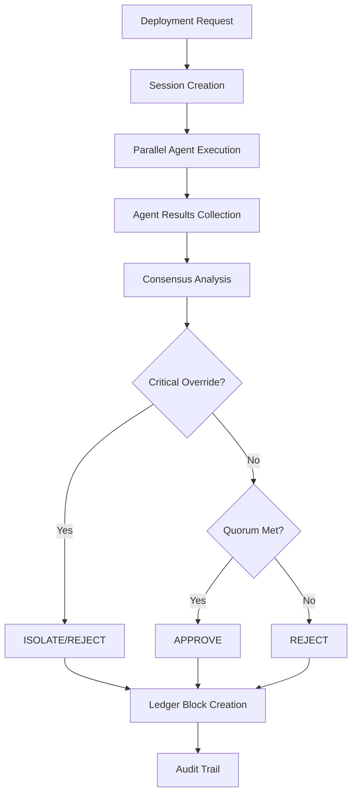

# Multi-Agent Validation System

A revolutionary, self-evolving, multi-agent deployment validation system using Google Gemini LLMs, advanced adversarial security concepts, and blockchain-inspired consensus mechanisms. This system implements field-tested red teaming, AI threat modeling, and resilience strategies inspired by Microsoft AI Red Team (PyRIT) and enterprise security frameworks.

## 🏗️ System Architecture

### Core Components

- **13 Specialized Agents** - Each with unique expertise and validation capabilities
- **Blockchain Guardrails** - Immutable security policies and consensus mechanisms
- **System Constitution** - Non-negotiable principles governing all operations
- **Parallel Execution Framework** - Concurrent agent processing with deterministic synchronization
- **Consensus Engine** - Quorum-based decision making with critical override capabilities

### Agent Ecosystem

#### 1. Security Agent (Securo-Sentinel)
- **Role**: Advanced cybersecurity validation with Microsoft Bug Bar scoring
- **Capabilities**: 
  - Static/dynamic code analysis
  - CVE scanning and vulnerability assessment
  - SQL injection, XSS, path traversal detection
  - Cryptographic weakness identification
  - Secret and credential exposure detection
- **Output**: `{'pass_status': bool, 'report': markdown, 'bug_bar_score': int, 'vulnerabilities': list}`
- **Threat Levels**: CRITICAL (5), HIGH (4), MEDIUM (3), LOW (2), INFO (1)

#### 2. Red Team Agent (Red-Team-Specter)
- **Role**: Automated adversarial testing using PyRIT-like methodologies
- **Capabilities**:
  - Prompt injection simulation
  - Fuzzing and buffer overflow testing
  - Social engineering attack simulation
  - Data poisoning and model evasion testing
  - Backdoor attack detection
  - Privilege escalation testing
- **Output**: `{'adversarial_results': list, 'risk_score': float, 'success_rate': float}`
- **Attack Types**: 8 different attack simulation categories

#### 3. Anomaly Detection Agent (Sentinel-Orbit)
- **Role**: ML/telemetry-based anomaly detection
- **Capabilities**:
  - Behavioral analysis and pattern recognition
  - Statistical anomaly detection
  - Performance deviation analysis
  - Unusual access pattern detection
- **Output**: `{'anomalies_found': list, 'severity': int, 'confidence': float}`

#### 4. Threat Model Agent
- **Role**: Microsoft-inspired threat modeling against ML threat taxonomy
- **Capabilities**:
  - Attack vector identification
  - Attacker profile assessment
  - Defense coverage evaluation
  - Business impact analysis
- **Output**: Risk model and policy recommendations

#### 5. Compliance Agent (Regulo-Guardian)
- **Role**: Regulatory and policy compliance validation
- **Capabilities**:
  - GDPR, SOC2, HIPAA compliance checking
  - Data privacy regulation adherence
  - Industry standard compliance
  - Policy violation detection
- **Output**: `{'pass_status': bool, 'compliance_report': list, 'violations': list}`

#### 6. Authorization Agent (Auth-Warden)
- **Role**: Role-based access control and identity verification
- **Capabilities**:
  - Commit hash verification
  - Author metadata validation
  - Permission matrix checking
  - Access control list validation
- **Output**: `{'pass_status': bool, 'authorization_summary': text}`

#### 7. Performance Agent (Perf-Maestro)
- **Role**: Performance benchmarking and regression detection
- **Capabilities**:
  - Canary deployment telemetry analysis
  - Performance regression detection
  - Resource utilization monitoring
  - SLA compliance checking
- **Output**: `{'pass_status': bool, 'performance_report': text, 'metrics': dict}`

#### 8. Explainability Agent (Lucid-Analyst)
- **Role**: Human-readable explanations of agent decisions
- **Capabilities**:
  - Decision rationale generation
  - Audit trail explanation
  - Trust and transparency reporting
  - Stakeholder communication
- **Output**: `{'explanations': list, 'rationale': text, 'confidence': float}`

#### 9. Privacy Agent (Data-Sentry)
- **Role**: PII detection and data privacy protection
- **Capabilities**:
  - Sensitive data scanning
  - Privacy violation detection
  - Data anonymization verification
  - Consent management checking
- **Output**: `{'privacy_issues': list, 'severity': int, 'pii_detected': bool}`

#### 10. Dependency Agent (DepAware)
- **Role**: Supply chain security and dependency analysis
- **Capabilities**:
  - CVE scanning for dependencies
  - Deprecation analysis
  - Maintenance assessment
  - License compliance checking
- **Output**: `{'risk_dependencies': list, 'alternatives': list, 'cve_count': int}`

#### 11. Ethical Agent (Ethos-Guardian)
- **Role**: AI ethics, fairness, and legal compliance
- **Capabilities**:
  - Bias detection and fairness assessment
  - Legal compliance checking
  - Ethical framework validation
  - Responsible AI principles
- **Output**: `{'ethical_concerns': list, 'legal_flags': list, 'fairness_score': float}`

#### 12. Evolutionary Optimizer Agent (Evo-Strategist)
- **Role**: System optimization and parameter tuning
- **Capabilities**:
  - Historical analysis and learning
  - Parameter optimization
  - Performance tuning
  - Adaptive threshold adjustment
- **Output**: `{'proposed_mutations': list, 'optimization_suggestions': list}`

#### 13. Veto-Validator
- **Role**: Final consensus aggregation and decision enforcement
- **Capabilities**:
  - Quorum enforcement (75% threshold)
  - Critical override logic
  - Final verdict determination
  - Immutable ledger block creation
- **Output**: `{'final_verdict': string, 'consensus_score': float, 'ledger_block': dict}`

## 🔒 Blockchain Guardrails Framework

### Core Principles

The system operates under immutable, non-negotiable blockchain-inspired principles:

1. **Immutability**: All validated blocks and audit logs cannot be modified
2. **Zero-Trust**: Success only after quorum of agents passes
3. **Parallel Validation**: All agents run concurrently for speed & resilience
4. **Trap-and-Isolate**: High-confidence threats trigger sandboxing
5. **Session Coherence**: All analysis tied to unique session_id

### Validation Rules

#### Proof of Stake System
- **Stake Range**: 0-1000 credits per agent
- **Reputation Range**: 0-100 points per agent
- **Weight Calculation**: `weight = 0.50*(stake/1000) + 0.30*(reputation/100) + 0.20*(1-normalizedLoad)`
- **Critical Operations**: Require minimum 500 stake
- **Stake Updates**: Dual-signed operations with Merkle proofs

#### Consensus Requirements
- **Quorum Threshold**: 75% (configurable)
- **Minimum Agents**: 3 for valid consensus
- **Critical Override**: High-confidence threats can override quorum
- **Timestamp Tolerance**: ±5 seconds drift allowed
- **Sequence Monotonicity**: Strict nonce progression required

#### Attestation Format
```json
{
  "proposal_id": "string",
  "timestamp_iso": "ISO8601",
  "agent_id": "string",
  "agent_stake": "integer",
  "decision": "allow|deny|challenge",
  "confidence_score": "0-100",
  "evidence_merkle_root": "hex",
  "sequence_nonce": "integer",
  "signature": "hex"
}
```

## 🚀 Workflow and Algorithms

### 1. Deployment Validation Workflow



### 2. Critical Override Algorithm

```python
CRITICAL_AGENTS = ["Red-Team-Specter", "Securo-Sentinel", "Threat-Model-Agent"]
OVERRIDE_CONFIDENCE_THRESHOLD = 0.8

if (agent_name in CRITICAL_AGENTS and 
    confidence >= OVERRIDE_CONFIDENCE_THRESHOLD and 
    verdict in ["REJECT", "ISOLATE"]):
    trigger_override()
    escalate_to_humans()
```

### 3. Consensus Calculation

```python
def calculate_consensus(agent_results):
    total_agents = len(agent_results)
    approval_count = sum(1 for r in agent_results if r.verdict == "APPROVE")
    consensus_score = approval_count / total_agents
    
    if consensus_score >= QUORUM_THRESHOLD:
        return "APPROVE"
    elif any(r.verdict == "ISOLATE" for r in agent_results):
        return "ISOLATE"
    else:
        return "REJECT"
```

### 4. Fallback Policies

#### API Failover Mechanism
- **Primary Failure**: Switch to backup API within 1000ms
- **Circuit Breaker**: Disable failing keys after 10% failure rate
- **Safe Mode**: Conservative defaults when all APIs fail
- **Cache Strategy**: Use stale data with clear labeling

#### Agent Failure Handling
- **Timeout**: 1.5s per agent, 0.5s progress heartbeats
- **Partial Results**: Proceed with available agents if quorum met
- **Escalation**: Human intervention for novel threats
- **Recovery**: Automatic retry with exponential backoff

## 📊 Configuration and Policies

### Environment Variables

```bash
# Gemini API Configuration
GEMINI_API_KEYS=key1,key2,key3
GEMINI_MODEL=gemini-1.5-pro
GEMINI_TEMPERATURE=0.1

# System Configuration
CONSENSUS_QUORUM_THRESHOLD=0.75
MAX_CONCURRENT_AGENTS=12
SESSION_TIMEOUT_SECONDS=300

# Security Configuration
ENABLE_RED_TEAM_TESTING=true
ENABLE_ADVERSARIAL_ANALYSIS=true
THREAT_MODELING_ENABLED=true
```

### Default Baselines

#### Security Baselines
- **Bug Bar Thresholds**: CRITICAL (5), HIGH (4), MEDIUM (3), LOW (2), INFO (1)
- **Vulnerability Patterns**: 10+ regex patterns for common vulnerabilities
- **CVE Database**: Pre-loaded patterns for Log4j, Spring4Shell, Heartbleed
- **Secret Detection**: Password, API key, token pattern matching

#### Performance Baselines
- **Response Time**: <200ms under nominal load
- **Uptime**: >=99% availability
- **Accuracy**: >=95% validation accuracy
- **Throughput**: Configurable based on system capacity

#### Compliance Baselines
- **GDPR**: Data protection and privacy requirements
- **SOC2**: Security, availability, processing integrity
- **HIPAA**: Healthcare data protection standards
- **AI Ethics**: Fairness, transparency, accountability

## 🔧 Usage Examples

### Basic Validation

```python
import asyncio
from main import MultiAgentValidator

async def validate_deployment():
    validator = MultiAgentValidator()
    
    deployment_context = {
        "commit_hash": "abc123def456",
        "author_metadata": {
            "name": "John Doe",
            "email": "john.doe@example.com"
        },
        "code": "def hello_world():\n    print('Hello, World!')",
        "dependencies": {
            "requests": "2.28.0",
            "numpy": "1.21.0"
        }
    }
    
    result = await validator.validate_deployment(deployment_context)
    print(f"Final Verdict: {result['final_verdict']}")
    print(f"Consensus Score: {result['consensus_score']}")

asyncio.run(validate_deployment())
```

### Advanced Configuration

```python
# Validate with specific agents
result = await validator.validate_deployment(
    deployment_context=deployment_context,
    agent_names=["Securo-Sentinel", "Red-Team-Specter", "Veto-Validator"],
    timeout_seconds=600
)

# Get system status
status = await validator.get_system_status()
print(f"System Status: {status['system_status']}")
```

## 🛡️ Security Features

### Immutable Audit Logging
- **SHA256 Hashing**: All agent actions logged with cryptographic integrity
- **Merkle Proofs**: Evidence verification through Merkle tree structures
- **Signed Attestations**: All decisions cryptographically signed
- **Chain of Custody**: Complete audit trail from request to decision

### Zero-Trust Architecture
- **No Single Point of Failure**: No single agent can approve deployments
- **Quorum-Based Consensus**: Multiple agents must agree
- **Critical Override**: High-confidence threats can override consensus
- **Trap-and-Isolate**: Automatic containment for severe threats

### Advanced Threat Detection
- **Microsoft Red Team Methodologies**: Proven attack simulation techniques
- **PyRIT-Inspired Testing**: Automated adversarial testing
- **ML Threat Taxonomy**: Comprehensive threat model coverage
- **Behavioral Anomaly Detection**: ML-based pattern recognition

## 📈 Monitoring and Analytics

### Performance Metrics
- **Agent Execution Times**: Individual and aggregate performance
- **Success/Failure Rates**: Per-agent and system-wide statistics
- **Consensus Accuracy**: Decision quality over time
- **Resource Utilization**: CPU, memory, network usage

### Health Monitoring
- **System Status**: Real-time operational health
- **Agent Health Checks**: Individual agent availability
- **API Key Rotation**: Automatic key management
- **Session Management**: Active session tracking

### Compliance Reporting
- **Audit Trails**: Complete decision history
- **Regulatory Compliance**: GDPR, SOC2, HIPAA status
- **Security Posture**: Threat detection effectiveness
- **Performance SLAs**: Service level agreement compliance

## 🔧 Extensibility

### Adding New Agents

1. **Create Agent Class**: Inherit from `ValidatorAgent`
2. **Implement Required Methods**: `validate()`, `get_prompt_template()`, `parse_response()`
3. **Add to System**: Update `_initialize_agents()` in `main.py`
4. **Update Imports**: Add to `agents/__init__.py`

### Custom Validation Rules

1. **Modify Constitution**: Update `system_constitution.py`
2. **Update Agent Prompts**: Modify agent-specific prompts
3. **Extend Consensus Logic**: Update `VetoValidator` logic
4. **Add Guardrails**: Extend `blockchain_guardrails.py`

## 🧪 Testing and Simulation

### Test Harness
- **Unit Tests**: Individual agent functionality
- **Integration Tests**: End-to-end validation flows
- **Chaos Engineering**: Fault injection and recovery testing
- **Deterministic Replay**: Historical incident reproduction

### Simulation Capabilities
- **Load Testing**: High-volume validation scenarios
- **Failover Testing**: API and agent failure simulation
- **Collusion Testing**: Anti-gaming validation
- **Performance Testing**: Latency and throughput analysis

## 📚 Documentation and Support

### Key Files
- `main.py` - Main orchestration system
- `blockchain_guardrails.py` - Security policy enforcement
- `system_constitution.py` - Core system principles
- `agents/` - Individual agent implementations
- `utils/` - Shared utilities and configurations

### Configuration Files
- `json_file_gpt.json` - Blockchain policy definitions
- `requirements.txt` - Python dependencies
- `env.example` - Environment variable template

### Testing Files
- `test_*.py` - Comprehensive test suite
- `test_payloads/` - Sample deployment contexts
- `demo_*.py` - Demonstration scripts

## 🚀 Getting Started

### Prerequisites
- Python 3.8+
- Google Gemini API key(s)
- Required Python packages (see requirements.txt)

### Installation

```bash
# Clone repository
git clone <repository-url>
cd agents

# Install dependencies
pip install -r requirements.txt

# Configure environment
cp env.example .env
# Edit .env with your Gemini API keys

# Run the system
python main.py
```

### Quick Test

```bash
# Test with sample deployment
python main.py --input test_payloads/deployment_1.json

# Check system status
python main.py --status

# Run specific agents
python main.py --agents Securo-Sentinel Red-Team-Specter --input test_payloads/deployment_1.json
```

## 🤝 Contributing

1. Fork the repository
2. Create a feature branch
3. Implement your changes
4. Add tests and documentation
5. Submit a pull request

## 📄 License

This project is licensed under the MIT License - see the LICENSE file for details.

## 🙏 Acknowledgments

- Microsoft AI Red Team (PyRIT) for red teaming methodologies
- Google Gemini for LLM capabilities
- OpenAI for AI safety research
- The open-source community for inspiration and tools
- google adk for agents development

---

**Note**: This system is designed for advanced security validation and should be used responsibly. Always follow security best practices and comply with applicable regulations.
